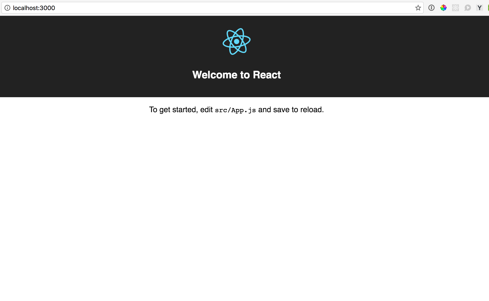
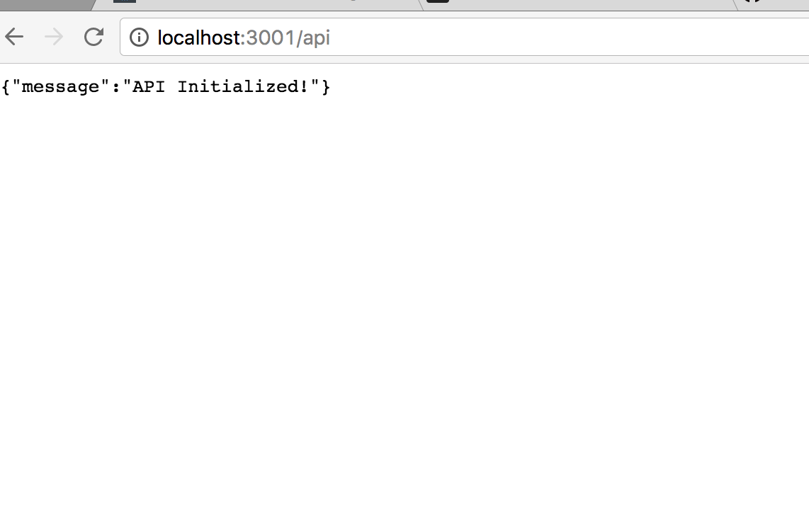
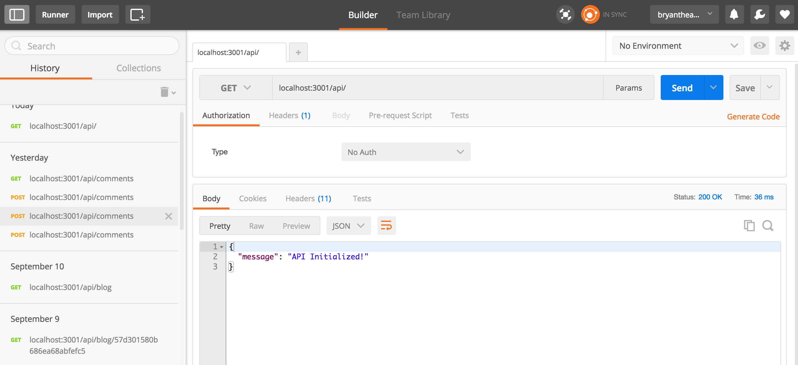
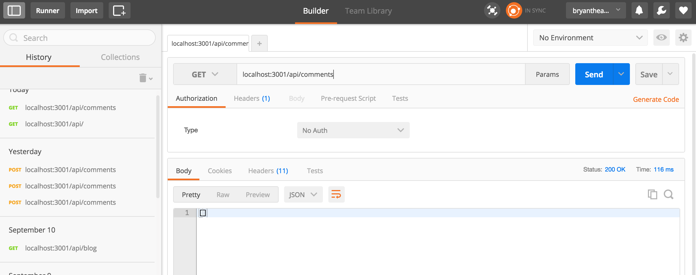
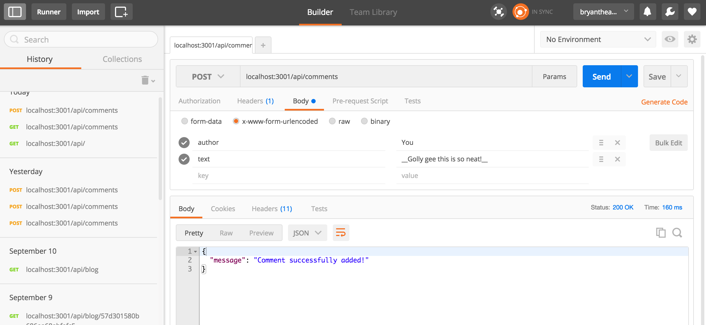
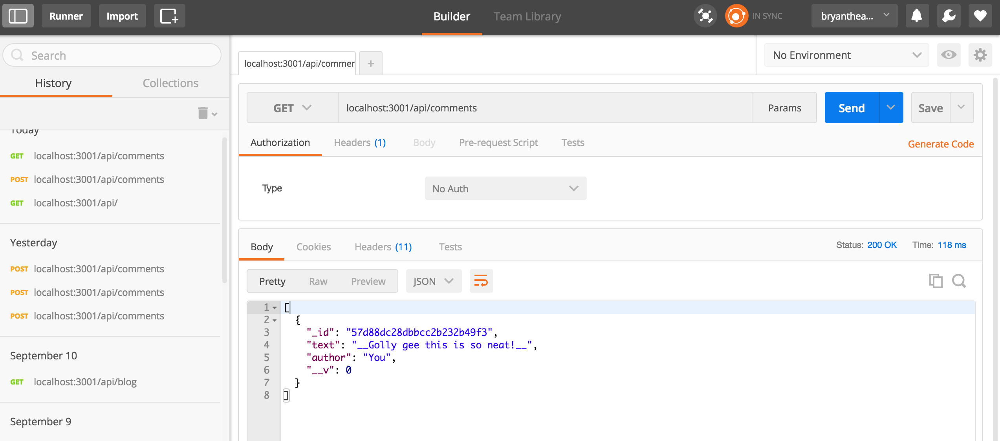
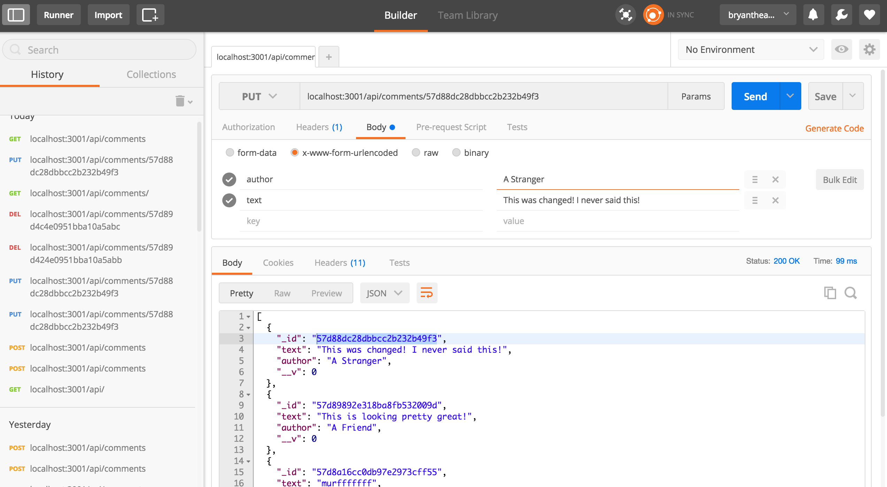

## React Getting Started -- The MERN Stack Tutorial! (feat. ES6!)
---

Hello!

In this tutorial, I will attempt to show you how to create a basic MERN (MongoDB/Express/React/Node.js) Stack application. We will be using Facebook's React Tutorial [which can be found here](https://facebook.github.io/react/docs/tutorial.html).

#### What this guide expects:
  - Basic understanding of React (the above tutorial is a great place to start)
  - ES6 Javascript -- I will try to make note when using something from it, but this guide is not a tutorial on either React or ES6.
  - Node/NPM installed

#### What this guide provides:
  - Introduction to setting up a full stack application with the MERN architecture.
  - Setting up a CRUD (create, read, update, delete) API via Express
  - Using that API to interact with an external database (we will use the free tier of MLab, but setting up your own is a small step from there.)
  - Terminal commands are from OSX -- if you are using Windows, commands may vary slightly

We will be using Facebook's new __Create React App__ to get started, so if you don't have that available, go into your terminal and type in `npm i -g create-react-app` (`i` is short for install, `-g` does a global install to be able to call it right from the command line. You may need to prefix this command with `sudo` if you do not have root access).

Okay, so lets get started!

The GitHub repo for this tutorial is available [here](https://github.com/bryantheastronaut/mernCommentBox).

---

### Our first steps...

The first thing we will do is create a skeleton React application to work with. This will save us from needing to configure a webpack file, incorporate babel for JSX use, and other React setup headaches.

`create-react-app merncommentbox && cd merncommentbox` will create the base for us and bring us to our working directory.

if we run `npm start`, we get this pretty little app here: 

Let's do a bit of cleanup of unnecessary files to start.

`cd src && rm App.css App.js App.test.js favicon.ico index.css logo.svg` to get rid of everything in the src file besides the _index.js_ file.

Now head into the _index.html_ in your root folder and remove the `<link rel="shortcut icon" href="./src/favicon.ico">` line in the head, since that file no longer exists. While we are here, we can change the title to something a bit more proper than the generic 'React App' -- I will call mine "Bryan's Fancy Full Stack App".

Now we can head into the _index.js_ file to get rid of the files we removed. Based on Facebook's Tutorial, we can make a change to the ReactDOM call as well and put in what we will be making next, which is the __CommentBox__. Your _index.js_ file should look like this:

```javascript
//index.js
import React from 'react';
import ReactDOM from 'react-dom';
import CommentBox from './CommentBox';

ReactDOM.render(
  <CommentBox />,
  document.getElementById('root')
);
```

We're so close to rendering our first thing! Let's `touch src/CommentBox.js src/Comment.js src/CommentForm.js src/CommentList.js` to create all the components we will be working with. Let's also `touch data.js` to make sure everything is working before we dive in. We should also make a folder to hold the Schema for our database, so we should make a folder called __model__ with a _comments.js_ file inside.

Our file structure will look like this:

    - model
      - comments.js
    - node_modules
      - ...various modules...
    - src
      - Comment.js
      - CommentBox.js
      - CommentForm.js
      - CommentList.js
      - index.js
      - style.js
    - .gitignore
    - data.js
    - index.html
    - package.json
    - README.md
    - server.js

I am a fan of modular inline css styling, so also `touch src/style.js` if you want to follow along with that. If you prefer to use a _style.css_ file instead, feel free. Please note that if you do, you will have to replace every
```javascript
import style from './style';
```    
call I use with

```javascript
import './style.css';
```
and every

```javascript
style={ style.uniqueName }
```

with

```javascript
className='uniqueName'
```
Go ahead and copy this file into _style.js_, and feel free to make any changes you see fit. It's not the prettiest, but its better than nothing.

```javascript
//style.js
const style = {
  commentBox: {
    width:'80vw',
    margin:'0 auto',
    fontFamily:'Helvetica, sans-serif'
  },
  title: {
    textAlign:'center',
    textTransform:'uppercase'
  },
  commentList: {
    border:'1px solid #f1f1f1',
    padding:'0 12px',
    maxHeight:'70vh',
    overflow:'scroll'
  },
  comment: {
    backgroundColor:'#fafafa',
    margin:'10px',
    padding:'3px 10px',
    fontSize:'.85rem'
  },
  commentForm: {
    margin:'10px',
    display:'flex',
    flexFlow:'row wrap',
    justifyContent:'space-between'
  },
  commentFormAuthor: {
    minWidth:'150px',
    margin:'3px',
    padding:'0 10px',
    borderRadius:'3px',
    height:'40px',
    flex:'2'
  },
  commentFormText: {
    flex:'4',
    minWidth:'400px',
    margin:'3px',
    padding:'0 10px',
    height:'40px',
    borderRadius:'3px'
  },
  commentFormPost: {
    minWidth:'75px',
    flex:'1',
    height:'40px',
    margin:'5px 3px',
    fontSize:'1rem',
    backgroundColor:'#A3CDFD',
    borderRadius:'3px',
    color:'#fff',
    textTransform:'uppercase',
    letterSpacing:'.055rem',
    border:'none'
  },
  updateLink: {
    textDecoration:'none',
    paddingRight:'15px',
    fontSize:'.7rem'
  },
  deleteLink: {
    textDecoration:'none',
    paddingRight:'15px',
    fontSize:'.7rem',
    color:'red'
  }
}

module.exports = style;
```

While we are here, let's install some other dependencies we will need coming up. `npm i axios express body-parser foreman nodemon marked mongoose --save` which will give us:

- Axios: let us use HTTP methods to communicate with our database.

- Express: provide a framework to set up our Node.js server.

- Body Parser: parse the incoming requests bodies for the info we are sending (gives us access to `req.body` which we will be using soon).

- Foreman: allows us to boot up our API and webpack-dev-server simultaneously.

- Nodemon: watches our server.js file for changes, then restarts it.

- Marked: to convert markdown syntax to html. I used this in place of Remarkable (which the FB tutorial uses)

- Mongoose: abstracts away the MongoDB boilerplate for a simple Schema solution.

Okay! We're all set up! Since this is not a React tutorial, I am just going to dump each component structure below as it is statically, then we will move forward with creating the server and rendering everything dynamically!

#### The Components!

__CommentBox.js__
```javascript
//CommentBox.js
import React, { Component } from 'react';
import CommentList from './CommentList';
import CommentForm from './CommentForm';
import DATA from '../data';
import style from './style';

class CommentBox extends Component {
  constructor(props) {
    super(props);
    this.state = { data: [] };
  }
  render() {
    return (
      <div style={ style.commentBox }>
        <h2>Comments:</h2>
      <CommentList data={ DATA }/>
      <CommentForm />
      </div>
    )
  }
}

export default CommentBox;
```

__CommentList.js__
```javascript
//CommentList.js
import React, { Component } from 'react';
import Comment from './Comment';
import style from './style';

class CommentList extends Component {
  render() {
    let commentNodes = this.props.data.map(comment => {
      return (
        <Comment author={ comment.author } key={ comment.id }>
          { comment.text}
        </Comment>
      )
    })
    return (
      <div style={ style.commentList }>
        { commentNodes }
      </div>
    )
  }
}

export default CommentList;
```

__CommentForm.js__
```javascript
//CommentForm.js
import React, { Component } from 'react';
import style from './style';

class CommentForm extends Component {
  constructor(props) {
    super(props);
    this.state = { author: '', text: '' };
    this.handleAuthorChange = this.handleAuthorChange.bind(this);
    this.handleTextChange = this.handleTextChange.bind(this);
    this.handleSubmit = this.handleSubmit.bind(this);
  }
  handleAuthorChange(e) {
    this.setState({ author: e.target.value });
  }
  handleTextChange(e) {
    this.setState({ text: e.target.value });
  }
  handleSubmit(e) {
    e.preventDefault();
    console.log(`${this.state.author} said "${this.state.text}"`)
    //we will be tying this into the POST method in a bit
  }
  render() {
    return (
      <form style={ style.commentForm } onSubmit={ this.handleSubmit }>
        <input
          type='text'
          placeholder='Your name...'
          style={ style.commentFormAuthor}
          value={ this.state.author }
          onChange={ this.handleAuthorChange } />
        <input
          type='text'
          placeholder='Say something...'
          style={ style.commentFormText}
          value={ this.state.text }
          onChange={ this.handleTextChange } />
        <input
          type='submit'
          style={ style.commentFormPost }
          value='Post' />
      </form>
    )
  }
}

export default CommentForm;
```

__Comment.js__
```javascript
//Comment.js
import React, { Component } from 'react';
import style from './style';
import marked from 'marked';

class Comment extends Component {
  rawMarkup() {
    let rawMarkup = marked(this.props.children.toString());
    return { __html: rawMarkup };
  }
  render() {
    return (
      <div style={ style.comment }>
        <h3>{this.props.author}</h3>
        <span dangerouslySetInnerHTML={ this.rawMarkup() } />
      </div>
    )
  }
}

export default Comment;
```

__data.js__
```javascript
//data.js
const data = [
  { id: 1, author: 'Bryan', text: 'Wow this is neat!'},
  { id: 2, author: 'You', text: 'youre __right!__'}
]

module.exports = data;
```

Okay now let's get to it for real!

#### Setting up server.js

From here we go into our _server.js_ file to set it up.

```javascript
//server.js
'use strict'

//first we import our dependencies...
var express = require('express');
var mongoose = require('mongoose');
var bodyParser = require('body-parser');

//and create our instances
var app = express();
var router = express.Router();

//set our port to either a predetermined port number if you have set it up, or 3001
var port = process.env.API_PORT || 3001;

//now we should configure the API to use bodyParser and look for JSON data in the request body
app.use(bodyParser.urlencoded({ extended: true }));
app.use(bodyParser.json());

//To prevent errors from Cross Origin Resource Sharing, we will set our headers to allow CORS with middleware like so:
app.use(function(req, res, next) {
  res.setHeader('Access-Control-Allow-Origin', '*');
  res.setHeader('Access-Control-Allow-Credentials', 'true');
  res.setHeader('Access-Control-Allow-Methods', 'GET,HEAD,OPTIONS,POST,PUT,DELETE');
  res.setHeader('Access-Control-Allow-Headers', 'Access-Control-Allow-Headers, Origin,Accept, X-Requested-With, Content-Type, Access-Control-Request-Method, Access-Control-Request-Headers');

  //and remove cacheing so we get the most recent comments
  res.setHeader('Cache-Control', 'no-cache');
  next();
});

//now  we can set the route path & initialize the API
router.get('/', function(req, res) {
  res.json({ message: 'API Initialized!'});
});

//Use our router configuration when we call /api
app.use('/api', router);

//starts the server and listens for requests
app.listen(port, function() {
  console.log(`api running on port ${port}`);
});
```

And now have our basic API up and running! If you run `node server.js` and direct your browser to [http://localhost:3001/api](http://localhost:3001/api), we can see our message!


This is all well and good to make sure the API is up and running, but once we want to start making post requests, this will get a bit convoluted. I recommend using something to run and test your API. I use Postman [which you can find here](http://www.getpostman.com).

If we run the same thing in Postman, we see the same success message:


Okay, awesome!

#### Integrating the Database

For this part, I will be using MLab [which you can find here](https://mlab.com). It is a database-as-a-service provider for MongoDB. Make a free account, then log in. Create a new database and click on the Users tab, then click add database user. Once you have a username and password, we can integrate it into our _server.js_ file.

On your MLab page, you should see something at the top that looks like this:


We will use the connect "using a driver via the standard MongoDB URI" option. Copy that link and add it to your _server.js_ file:

```javascript
//server.js

// ...(removed for brevity)
var port = process.env.API_PORT || 3001;

//db config
var mongoDB = 'mongodb://<DBUSERNAME>:<DBPASSWORD>@ds019836.mlab.com:19836/bryandb';
mongoose.connect(mongoDB, { useMongoClient: true })
var db = mongoose.connection;
db.on('error', console.error.bind(console, 'MongoDB connection error:'));
```

Mine looks like this. Yours will be different. Replace the `<dbuser>` and `<dbpassword>` and the database information with the database username and password and details you just created.

Next we will need to create the Schema that will show what our database entries look like.

__model/comments.js__
```javascript
//model/comments.js
'use strict';
//import dependency
var mongoose = require('mongoose');
var Schema = mongoose.Schema;

//create new instance of the mongoose.schema. the schema takes an object that shows
//the shape of your database entries.
var CommentsSchema = new Schema({
  author: String,
  text: String
});

//export our module to use in server.js
module.exports = mongoose.model('Comment', CommentsSchema);
```
Now back in our _server.js_ file we import that with our dependencies:
```javascript
//server.js
//...
var bodyParser = require('body-parser');
var Comment = require('./model/comments');
//...
```
You will need to restart server any time we make changes to the _server.js_ file. Fortunately for us, we installed nodemon earlier which will restart the server any time we make changes to the file. While we are at it, we will set up Foreman to run both the _server.js_ file and the React app at the same time (which we were previously using `npm run start` for).

Let's create a _Procfile_ in our root directory, which Foreman will use to determine which commands to run.

```javascript
web: react-scripts start
api: nodemon server.js
```

And now head into the _package.json_ file to add a start-dev script:

```javascript
//package.json
//...
    "start": "react-scripts start",
    "start-dev": "nf start -p 3000",
//...
```
Now when we `npm run start-dev`, we will start up both the React App, as well as the API!


#### Getting and posting to the database

In our _server.js_ file, we can now create a new route and give it GET and POST HTTP methods to retrieve data from and post data to our database we connected. Add this in below our root route:

```javascript
//... removed for brevity
//now  we can set the route path & initialize the API
router.get('/', function(req, res) {
  res.json({ message: 'API Initialized!'});
});

//adding the /comments route to our /api router
router.route('/comments')
  //retrieve all comments from the database
  .get(function(req, res) {
    //looks at our Comment Schema
    Comment.find(function(err, comments) {
      if (err)
        res.send(err);
      //responds with a json object of our database comments.
      res.json(comments)
    });
  })
  //post new comment to the database
  .post(function(req, res) {
    var comment = new Comment();
    //body parser lets us use the req.body
    comment.author = req.body.author;
    comment.text = req.body.text;

    comment.save(function(err) {
      if (err)
        res.send(err);
      res.json({ message: 'Comment successfully added!' });
    });
  });

//Use our router configuration when we call /api
//.........
```

Note that after you save, nodemon will automatically restart your server, so changes should be instantaneous. Now if we use Postman to check out our route we just created, /api/comments we see.... Nothing!


This is because our database is empty! Let's test out our brand new POST method we created and add our first comment! If we send a POST request to the same route /api/comments and put our author and text in, we should see our success message.

Now when you make another GET request, we see our comment!



#### Back to React!

Okay, now we're back on track going through Facebook's Tutorial. We will add the url prop of 'http://localhost:3001/api/comments' and the pollInterval prop set to 2000 to our CommentBox component in our _index.js_ file. It should now look like this:
```javascript
//index.js
import React from 'react';
import ReactDOM from 'react-dom';
import CommentBox from './CommentBox';

ReactDOM.render(
  <CommentBox
    url='http://localhost:3001/api/comments'
    pollInterval={2000} />,
  document.getElementById('root')
);
```

In our _CommentBox.js_ file, we need to change our data from our imported DATA to the state we created. It should now look like this:
```javascript
//CommentBox.js
import React, { Component } from 'react';
import CommentList from './CommentList';
import CommentForm from './CommentForm';
import style from './style';

class CommentBox extends Component {
  constructor(props) {
    super(props);
    this.state = { data: [] };
  }
  render() {
    return (
      <div style={ style.commentBox }>
        <h2>Comments:</h2>
      <CommentList data={ this.state.data }/>
      <CommentForm />
      </div>
    )
  }
}

export default CommentBox;
```

#### Using HTTP request with our friend Axios!

In our _CommentBox.js_ component, we will now add our AJAX call. We will use axios instead of jquery like they do in the original tutorial because I'm a bit biased against jQuery, especially when you only need it for its AJAX method. Plus the axios call just looks so much... sleeker. Make sure to add axios to your dependencies at the top.

```javascript
//CommentBox.js
import React, { Component } from 'react';
import axios from 'axios';
import CommentList from './CommentList';
import CommentForm from './CommentForm';
import style from './style';

class CommentBox extends Component {
  constructor(props) {
    super(props);
    this.state = { data: [] };
  }
  loadCommentsFromServer = () => {
    axios.get(this.props.url)
      .then(res => {
        this.setState({ data: res.data });
      })
  }
  handleCommentSubmit = (comment) => {
    //add POST request

  }
  componentDidMount() {
    this.loadCommentsFromServer();
    setInterval(this.loadCommentsFromServer, this.props.pollInterval);
  }
  render() {
    return (
      <div style={ style.commentBox }>
        <h2>Comments:</h2>
      <CommentList data={ this.state.data }/>
      <CommentForm onCommentSubmit={ this.handleCommentSubmit }/>
      </div>
    )
  }
}

export default CommentBox;
```
Now when you look at your react app, the new comment we added to the database via Postman is there! If you look in your developer console, we have a warning saying 'Each child in an array or iterator should have a unique "key" prop...'. MongoDB adds an ID tag to each post labeled "\_id". We can change our CommentList component to use it like so:

```javascript
//CommentList.js
import React, { Component } from 'react';
import Comment from './Comment';
import style from './style';

class CommentList extends Component {
  render() {
    let commentNodes = this.props.data.map(comment => {
      return (
        <Comment author={ comment.author } key={ comment['_id'] }>
          { comment.text}
        </Comment>
      )
    })
    return (
      <div style={ style.commentList }>
        { commentNodes }
      </div>
    )
  }
}

export default CommentList;
```
After making that change, the warning in the console is gone, and we are back under the 'React Best Practices' Umbrella. Isn't it so nice and dry under here?

If we go back to Postman and add another comment, we will see it automatically load on our page, since we added the pollInterval to check for new comments every 2 seconds.

#### Adding new posts

Let's change our _CommentForm.js_ component now. This is the same as the original Tutorial, except we're using some ES6 sweetness.

```javascript
//CommentForm.js
//...
handleSubmit(e) {
  e.preventDefault();
  let author = this.state.author.trim();
  let text = this.state.text.trim();
  if (!text || !author) {
    return;
  }
  this.props.onCommentSubmit({ author: author, text: text });
  this.setState({ author: '', text: '' });
}
//...
```

And now in our CommentBox component, we can finally add our axios post method to send our new posts to our database!

```javascript
//CommentBox.js
//replace the filler with:
handleCommentSubmit(comment) {
  axios.post(this.props.url, comment)
    .then(res => {
      this.loadCommentsFromServer();
    })
    .catch(err => {
      console.error(err);
    });
}
```
#### Optimizing Comments

We can finish up the Facebook tutorial now with a bit of optimization to our CommentBox component.
```javascript
//CommentBox.js
//...
handleCommentSubmit(comment) {
  let comments = this.state.data;
  comment._id = Date.now();
  let newComments = comments.concat([comment]);
  this.setState({ data: newComments });
  axios.post(this.props.url, comment)
    .catch(err => {
      console.error(err);
      this.setState({ data: comments });
    });
}
//...
```
Now as soon as you add a comment, it is immediately added to the list!


Now we move past the tutorial into parts unknown! How you holding up? I know this is long. You're a champ though! Ready?

#### Putting the UD in CRUD!

Let's hop back into our _server.js_ file one more time to add the PUT (Update) and DELETE (...Delete) routes to our API. We will need to direct them to a specific post, so we can use the `:params` route to specify which comment we are referring to.

 ```javascript
 //server.js
 //Add this after our get and post routes
 //Adding a route to a specific comment based on the database ID
router.route('/comments/:comment_id')
//The put method gives us the chance to update our comment based on the ID passed to the route
  .put(function(req, res) {
    Comment.findById(req.params.comment_id, function(err, comment) {
      if (err)
        res.send(err);
      //setting the new author and text to whatever was changed. If nothing was changed
      // we will not alter the field.
      (req.body.author) ? comment.author = req.body.author : null;
      (req.body.text) ? comment.text = req.body.text : null;
      //save comment
      comment.save(function(err) {
        if (err)
          res.send(err);
        res.json({ message: 'Comment has been updated' });
      });
    });
  })
  //delete method for removing a comment from our database
  .delete(function(req, res) {
    //selects the comment by its ID, then removes it.
    Comment.remove({ _id: req.params.comment_id }, function(err, comment) {
      if (err)
        res.send(err);
      res.json({ message: 'Comment has been deleted' })
    })
  });
```

Now if we go back into Postman, we can send either a DELETE or PUT request with the "\_id" at the end of the url. Sending a DELETE request will remove it, and sending a PUT request with a different author or text will update the comment.


We need to add a place to update and delete each comment, so we will add links for each at the bottom of _Comment.js_. In the same file, we need to access the comment's id, but cannot use the key prop. Set a uniqueID prop which is the same as the key. We will also handle the comment deletion and updates similarly to how we handled the form submit, that is to put the HTTP requests sent by axios in the _CommentBox.js_ component, and pass it down as props. All our components should look like so:

```javascript
//CommentBox.js
import React, { Component } from 'react';
import axios from 'axios';
import CommentList from './CommentList';
import CommentForm from './CommentForm';
import style from './style';

class CommentBox extends Component {
  constructor(props) {
    super(props);
    this.state = { data: [] };
  }
  loadCommentsFromServer = () => {
    axios.get(this.props.url)
      .then(res => {
        this.setState({ data: res.data });
      })
  }
  handleCommentSubmit = (comment) => {
    let comments = this.state.data;
    comment.id = Date.now();
    let newComments = comments.concat([comment]);
    this.setState({ data: newComments });
    axios.post(this.props.url, comment)
      .catch(err => {
        console.error(err);
        this.setState({ data: comments });
      });
  }
  handleCommentDelete = (id) => {
    axios.delete(`${this.props.url}/${id}`)
      .then(res => {
        console.log('Comment deleted');
      })
      .catch(err => {
        console.error(err);
      });
  }
  handleCommentUpdate => (id, comment) => {
    //sends the comment id and new author/text to our api
    axios.put(`${this.props.url}/${id}`, comment)
      .catch(err => {
        console.log(err);
      })
  }
  componentDidMount() {
    this.loadCommentsFromServer();
    setInterval(this.loadCommentsFromServer, this.props.pollInterval);
  }
  render() {
    return (
      <div style={ style.commentBox }>
        <h2 style={ style.title }>Comments:</h2>
      <CommentList
        onCommentDelete={ this.handleCommentDelete }
        onCommentUpdate={ this.handleCommentUpdate }
        data={ this.state.data }/>
      <CommentForm onCommentSubmit={ this.handleCommentSubmit }/>
      </div>
    )
  }
}

export default CommentBox;
```
```javascript
//CommentList.js
import React, { Component } from 'react';
import Comment from './Comment';
import style from './style';

class CommentList extends Component {
  render() {
    let commentNodes = this.props.data.map(comment => {
      return (
        <Comment
          author={ comment.author }
          uniqueID={ comment['_id'] }
          onCommentDelete={ this.props.onCommentDelete }
          onCommentUpdate={ this.props.onCommentUpdate }
          key={ comment['_id'] }>
          { comment.text }
        </Comment>
      )
    })
    return (
      <div style={ style.commentList }>
        { commentNodes }
      </div>
    )
  }
}

export default CommentList;
```
```javascript
//Comment.js
import React, { Component } from 'react';
import style from './style';
import marked from 'marked';

class Comment extends Component {
  constructor(props) {
    super(props);
    this.state= {
      toBeUpdated: false,
      author: '',
      text: ''
    };
  }
  updateComment = (e) => {
    e.preventDefault();
    //brings up the update field when we click on the update link.
    this.setState({ toBeUpdated: !this.state.toBeUpdated });
  }
  handleCommentUpdate = (e) => {
    e.preventDefault();
    let id = this.props.uniqueID;
    //if author or text changed, set it. if not, leave null and our PUT request
    //will ignore it.
    let author = (this.state.author) ? this.state.author : null;
    let text = (this.state.text) ? this.state.text : null;
    let comment = { author: author, text: text};
    this.props.onCommentUpdate(id, comment);
    this.setState({
      toBeUpdated: !this.state.toBeUpdated,
      author: '',
      text: ''
    })
  }
  deleteComment = (e) => {
    e.preventDefault();
    let id = this.props.uniqueID;
    this.props.onCommentDelete(id);
    console.log('oops deleted');
  }
  handleTextChange = (e) => {
    this.setState({ text: e.target.value });
  }
  handleAuthorChange = (e) => {
    this.setState({ author: e.target.value });
  }
  rawMarkup() {
    let rawMarkup = marked(this.props.children.toString());
    return { __html: rawMarkup };
  }
  render() {
    return (
      <div style={ style.comment }>
        <h3>{this.props.author}</h3>
        <span dangerouslySetInnerHTML={ this.rawMarkup() } />
        <a style={ style.updateLink } href='#' onClick={ this.updateComment }>update</a>
        <a style={ style.deleteLink } href='#' onClick={ this.deleteComment }>delete</a>
        { (this.state.toBeUpdated)
          ? (<form onSubmit={ this.handleCommentUpdate }>
              <input
                type='text'
                placeholder='Update name...'
                style={ style.commentFormAuthor }
                value={ this.state.author }
                onChange= { this.handleAuthorChange } />
              <input
                type='text'
                placeholder='Update your comment...'
                style= { style.commentFormText }
                value={ this.state.text }
                onChange={ this.handleTextChange } />
              <input
                type='submit'
                style={ style.commentFormPost }
                value='Update' />
            </form>)
          : null}
      </div>
    )
  }
}

export default Comment;
```
```javascript
//CommentForm.js
import React, { Component } from 'react';
import style from './style';

class CommentForm extends Component {
  constructor(props) {
    super(props);
    this.state = { author: '', text: '' };
  }
  handleAuthorChange = (e) => {
    this.setState({ author: e.target.value });
  }
  handleTextChange = (e) => {
    this.setState({ text: e.target.value });
  }
  handleSubmit = (e) => {
    e.preventDefault();
    let author = this.state.author.trim();
    let text = this.state.text.trim();
    if (!text || !author) {
      return;
    }
    this.props.onCommentSubmit({ author: author, text: text });
    this.setState({ author: '', text: '' });
  }
  render() {
    return (
      <form style={ style.commentForm } onSubmit={ this.handleSubmit }>
        <input
          type='text'
          placeholder='Your name...'
          style={ style.commentFormAuthor}
          value={ this.state.author }
          onChange={ this.handleAuthorChange } />
        <input
          type='text'
          placeholder='Say something...'
          style={ style.commentFormText}
          value={ this.state.text }
          onChange={ this.handleTextChange } />
        <input
          type='submit'
          style={ style.commentFormPost }
          value='Post'/>
      </form>
    )
  }
}

export default CommentForm;
```

===

Thats it! It's not the prettiest app in the world, but hopefully it's enough to get you started and understanding how these technologies all tie together. There is definitely a lot that I could have abstracted, or reworked components to be reused (I mean... how similar is the CommentForm to the Comment Update Form?!?!). Let me know in the comments how yours turned out, or feel free to reach out to me with any questions or just to chat on Twitter: @SpaceBrayn.

Until next time! Its been...

===
